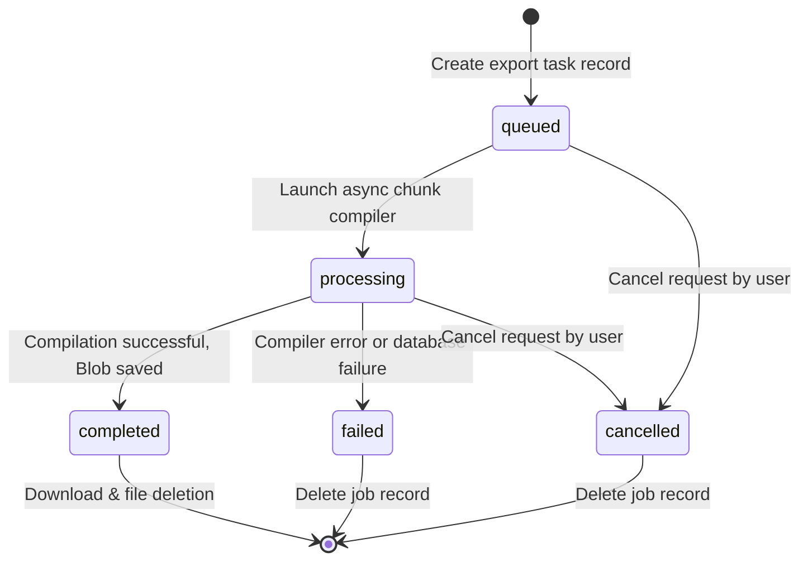

# Advanced Export System Specification

This document details the architecture, datasets schema mapping, job lifecycle transitions, security regulations, and file formats supported by the Toolique Advanced Export System.

---

## 1. Supported Formats

### 1.1 CSV (.csv / .zip)
- **UTF-8 Support**: Prepend standard UTF-8 Byte Order Mark (`\uFEFF`) to ensure Excel and other spreadsheet editors correctly render Indian languages, Unicode, and emojis.
- **Relational Splitting**: If multiple datasets are selected, the engine packages individual CSV sheets inside a single ZIP file containing:
  - `pages.csv`
  - `issues.csv`
  - `links.csv`
  - `redirects.csv`
  - `images.csv`
  - `resources.csv`
  - `architecture_nodes.csv`
  - `architecture_edges.csv`
- **CSV Injection Prevention**: Encodes string values. Cell values starting with dangerous spreadsheet operators (`=`, `+`, `-`, `@`) are prefixed with a single quote (`'`) to disable formula execution while maintaining raw text content.

### 1.2 JSON (.json)
- Consolidates the complete relational crawler snapshot into a structured schema preservation format:
```json
{
  "crawl": {
    "crawlId": "example-com-uuid",
    "timestamp": "2026-08-26T08:00:00Z",
    "totalURLs": 1248,
    "exportedURLs": 1200
  },
  "pages": [...],
  "issues": [...],
  "links": [...],
  "redirects": [...],
  "images": [...],
  "resources": [...],
  "architecture": {
    "nodes": [...],
    "edges": [...]
  }
}
```

### 1.3 XLSX (.xlsx)
- Compiles a single Workbook containing separate sheets: `Summary`, `Pages`, `Issues`, `Links`, `Redirects`, `Images`, `Resources`, `SEO`, `Security`, `Performance`, `Architecture Nodes`, `Architecture Edges`.
- **UX Styling**: Freeze header rows (`ySplit: 1`) and enable column filters (`!autofilter` ranges).

### 1.4 PDF Report (.pdf)
- A professional, executive diagnostics report.
- Features: Cover page, executive summaries, HTTP response code charts/distributions, indexability outlines, redirect cycle stats, security observed header lists, and prioritized top 10 technical issues list.
- **Constraints**: Large tables are capped at summary counts or samples. Full dumps of 10,000 pages are strictly reserved for CSV/XLSX/JSON.

---

## 2. Export Datasets & Fields

### 2.1 Pages
- **URL / Normalized URL**: Full address.
- **HTTP Status**: Numerical status code.
- **Content Type**: MIME type.
- **Crawl Depth**: Integer depth level from seed.
- **Title / Meta Description**: Extracted tags & lengths.
- **Canonical**: Declared canonical link.
- **Indexability**: Indexable vs. blocked status.
- **H1 / Word Count**: Content structure parameters.
- **Response Size (Bytes) / Time (ms)**: Observed download size & latency.
- **Score**: Dynamic page score: `100 - sum(deductions)`.

### 2.2 Issues
- **Issue ID**: Unique generated key.
- **Rule ID**: Specific analyzer code (e.g. `SEO_TITLE_MISSING`).
- **Category / Severity**: Classification & severity tier.
- **URL**: Affected page URL.
- **Evidence**: Extracted context (JSON serialized).

### 2.3 Links
- **Source / Destination**: Linking coordinates.
- **Anchor Text**: Visually declared anchor.
- **Internal/External**: Classification.
- **Discovery Source**: Discovery source type (`SITEMAP`, `INTERNAL_LINK`, etc.).

### 2.4 Redirects
- **Source / Destination / HTTP Status / Chain Length / Final Destination / Loop Status**.

### 2.5 Images
- **Page URL / Image URL / Alt Text / Width & Height / Loading Attribute / Relation Type / Link Status**.

### 2.6 Resources
- **Page URL / Resource URL / Resource Type / Status / Relation Type / Content Type**.

### 2.7 SEO
- **URL / Title / Meta Description / H1 / Canonical / Robots Meta / Hreflang Count / Open Graph / Twitter Cards / Structured Data Count**.

### 2.8 Security
- **URL / HTTPS / HSTS / CSP / X-Frame-Options / X-Content-Type-Options / Referrer-Policy / Permissions-Policy / COOP / COEP**.
- Clearly classified: `Present`, `Missing`, `Malformed`, `Not observed`.

### 2.9 Performance
- **URL / Total Response Time (ms) / Response Size (Bytes)**. Low-level TCP socket times (DNS, TLS, TTFB) are marked `Not observed` due to browser sandbox constraints.

### 2.10 Architecture
- **Nodes**: Node ID, URL, HTTP Status, Crawl Depth, Inbound Link count, Outbound Link count.
- **Edges**: Source, Destination, Link relationship type, Anchor Text, Status.

---

## 3. Job Lifecycle & Queue States



---

## 4. Retention Policy & Cleanups

- **24-Hour File Expiration**: All generated export files (stored in IndexedDB `export_files` store) and progress logs expire 24 hours after their creation.
- **Automated Scanning**: The crawler automatically scans and purges expired jobs and file Blobs on:
  - Application startup / Tab load.
  - Initiation of any new export jobs.

---

## 5. Security & SSRF Safeguards

- **SSRF Blockings**: Requests targeting local networks (e.g. `localhost`, `127.0.0.1`, `169.254.169.254`) are blocked before leaving the client sandbox.
- **Redaction of Secrets**: Generated reports redact cookies, bearer authorization tokens, access keys, or internal routing headers to prevent leakage.
- **Path Traversal Protection**: Filenames are sanitized, removing relative path notation (`../`, `..\\`).
