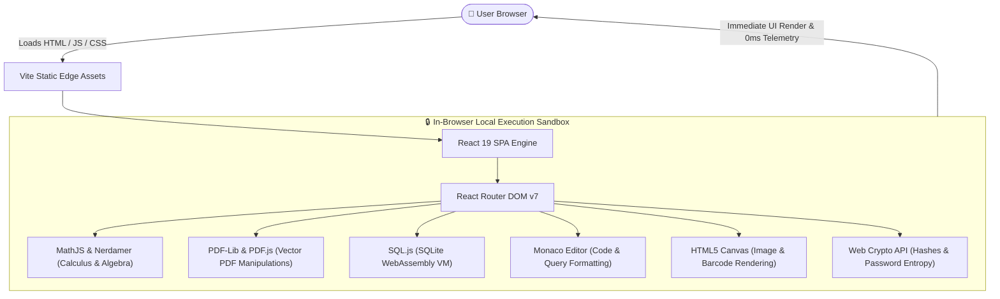

<div align="center">

# ⚡ Toolique

### **The All-in-One Professional In-Browser Suite for India & Global Creators**
*298+ High-Performance Calculators, Engineering Solvers, Media Utilities & Developer Tools.*

[](https://react.dev/)
[](https://vitejs.dev/)
[](https://www.typescriptlang.org/)
[](https://tailwindcss.com/)
[](#-100-in-browser-privacy--security)
[](#-architecture-overview)
[](LICENSE)

[**Explore Live App »**](https://toolique.com) · [**Report a Bug**](https://github.com/ajinkyaswami1999/Toolique/issues) · [**Request a Tool**](https://github.com/ajinkyaswami1999/Toolique/issues)

</div>

---

## 🌟 Overview

**Toolique** is a lightning-fast, privacy-first web platform engineered with **React 19**, **Vite 8**, **TypeScript**, and **Tailwind CSS v4**. It packs **298+ professional-grade computational suites** across 22 specialized domains—ranging from Indian tax compliance (GST, TDS, Old vs. New Regime) and architectural zoning algorithms (FAR/FSI, setback checkers, NBC India standards) to 3D printing economics, advanced mathematics, PDF processing, barcode/QR generation, and developer utilities.

Unlike conventional web tools that send sensitive files and user inputs to remote servers, **Toolique computes 100% of calculations client-side in the user's web browser** using modern Web APIs, Web Workers, WebAssembly (WASM), and Canvas pipelines.

---

## 🚀 Key Highlights & Architectural Strengths

### 🔒 100% In-Browser Privacy & Zero Data Transmission
Every file you merge, password you test, salary you calculate, image you compress, and SQL query you execute stays strictly within your browser's local sandbox memory. **Zero cookies tracking data, zero cloud databases, and zero telemetry payloads.**

### ⚡ Zero-Latency Instant Computation
No round-trip server requests or queuing delays. Algorithms run at native JavaScript / WebAssembly execution speeds with immediate reactive UI feedback powered by React 19.

### 🇮🇳 Engineered for Indian Regulations & Standards
- **Finance & Tax**: Real-time CGST, SGST, IGST splits; FY 2024-25 / FY 2025-26 Union Budget income tax slabs; Section 194C/J/I/H TDS calculations; NPCI-standard UPI QR codes for GPay, PhonePe, Paytm, and BHIM.
- **Construction & Civil**: IS 456 concrete mix ratios, steel reinforcement unit weights, brick/mortar volume formulas, and Advanced BOQ generator.
- **Architecture & Real Estate**: Comprehensive National Building Code (NBC) India parameters, state-wise Master Plan FAR/FSI rules (Maharashtra Unified DCR, Delhi MPD, Karnataka, Tamil Nadu), and setback regulations.
- **Astrological & Date Calculations**: Exact Julian/Gregorian leap year math, age on target cut-off dates for Indian exams (UPSC, SSC, IBPS, NEET), plus Vedic Janam Kundali Nakshatra & Vimshottari Mahadasha cycles.

### 🔍 Optimized for Google #1 Ranking & AI Answer Engines (SEO / AEO / GEO)
- Pre-rendered static shells and programmatic multi-tier `sitemap.xml` with **475+ indexed endpoints**.
- Deep schema markup (`SoftwareApplication`, `FAQPage`, `HowTo`, `BreadcrumbList`, `Organization`).
- Authoritative technical documentation and mathematical guides tailored for direct citation in Google SGE, Perplexity, ChatGPT, Claude, and Gemini.

---

## 🛠️ Tool Catalog & Categorized Matrix (298+ Tools)

Toolique organizes its expansive tool ecosystem into **22 dedicated industry suites**:

| Domain / Category | Tools | Flagship Highlights & Capabilities |
| :--- | :---: | :--- |
| **📐 Architecture & Planning** | `71` | FAR / FSI Plot Calculators, NBC India Setback Verifiers, Staircase Dimensions, Site Coverage, Parking Space Planner, Ramp Slope ADA / NBC Compliance |
| **🖨️ 3D Printing Studio** | `40` | Filament Cost, Multi-Color AMS Purge Waste, Resin Volume Solver, Print Farm Profitability, Slice Time Estimator, 3D Image-to-Filament Maker |
| **💻 Developer Utilities** | `25` | Monaco SQL Formatter, SQLite in WASM, JSON Validator & Beautifier, Regex Engine, Universal Barcode Studio (11+ Symbologies), JWT Decoder, Hash Generator |
| **📈 Economics & Market Suite**| `24` | Keynesian Multiplier, Price Elasticity of Demand, Inflation Adjuster, Break-Even Analysis, Market Equilibrium, Marginal Revenue |
| **🧮 Advanced Math Studio** | `22` | Symbolic Equation Solver, Matrix Algebra, Probability & Statistics, Derivatives & Integrals, Unit Converters |
| **📑 PDF Power Tools** | `17` | Merge, Split, Lossless Compression, PDF to Image, Password Lock/Unlock, Watermarking, Text & Image Extractors, PDF Table Exporter |
| **💰 Finance & Indian Tax** | `14` | GST Split (CGST/SGST), FY 24-26 In-Hand Salary (Old vs New Regime), TDS under Sec 194, SIP Compounding, Home/Car EMI Amortization, CAGR |
| **🏗️ Civil Engineering** | `12` | Concrete Mix Design (M15 to M30), Steel Reinforcement Weight, Brick & Mortar Calculator, Sand & Cement Estimation, BOQ Costing |
| **🖼️ Image & Media Studio** | `12` | Canvas Image Compressor, Batch Resizer, HEIC to JPEG/PNG, SVG Optimizer, WebP Converter, YouTube Thumbnail Creator |
| **⚡ Electrical Engineering** | `10` | Cable Wire Gauge Sizing, Voltage Drop Calculator, Solar PV Rooftop Estimator, Battery Backup Duration, Load Schedule |
| **📱 Social Media Suite** | `10` | Platform Aspect Ratio Resizers, Hashtag Engine, Caption Formatter, Bio Link Staging, Engagement Rate Analyzer |
| **🌐 Web & SEO Tools** | `9` | Meta Tag & Open Graph Generator, Robots.txt Generator, Sitemap Validator, Website SEO Audit, Minifier |
| **💼 Business & Commerce** | `9` | Profit Margin & Markup, Discount Calculator, Currency Converter, GST Invoice Maker, Break-Even Units |
| **🛡️ QA & Testing Tools** | `8` | Automated Test Case Builder, Synthetic Mock Data Generator, Bug Report Markdown Composer, API Parameter Tester |
| **🛋️ Interior Design** | `4` | Modular Kitchen Cost Estimator, False Ceiling Material Calculator, Wardrobe Costing, Flooring & Tile Layout |
| **📅 Date, Time & Vedic** | `3` | Chronological Age & DOB Engine with Vedic Dasha & Nakshatra, Professional Experience Duration, Business Working Days |
| **🚗 Automobile & EV** | `2` | Fuel Mileage & Trip Budget Planner, Electric Vehicle (EV) Charging Cost & Range Estimator |
| **🎓 Student & Academic** | `2` | CGPA / GPA to Percentage Converter, Attendance Target Goal Tracker |
| **🔐 Security & Crypto** | `1` | Cryptographic Password Generator & Entropy Strength Tester |
| **🩺 Health & Wellness** | `1` | Body Mass Index (BMI), Basal Metabolic Rate (BMR), Daily Caloric & Hydration Target |
| **⚖️ Universal Converters** | `1` | Multi-Metric Engineering, Scientific & Imperial Unit Conversion Hub |
| **📝 Text Utilities** | `1` | Word, Character, Syllable & Reading Time Counter with Diff Checker |

---

## 🏗️ Architecture & Technical Stack



### Core Technologies
- **UI Framework**: [React 19](https://react.dev/) & [TypeScript](https://www.typescriptlang.org/)
- **Build Engine & Bundler**: [Vite 8](https://vitejs.dev/) with Rolldown optimizations
- **Styling & Design System**: [Tailwind CSS v4](https://tailwindcss.com/) & [Lucide Icons](https://lucide.dev/)
- **Animations & Micro-interactions**: [Framer Motion](https://www.framer.com/motion/)
- **In-Browser PDF Processing**: `pdf-lib`, `pdfjs-dist`, `jspdf`
- **WebAssembly SQLite Virtual Machine**: `sql.js`
- **Code & Syntax Studio**: `@monaco-editor/react`, `sql-formatter`
- **Barcode & 2D Matrix Rendering**: `jsbarcode`, `qrcode`, `jsqr`
- **Mathematical Computation Engine**: `mathjs`, `nerdamer`
- **Client-Side Image Manipulation**: `heic2any`, `canvas`, `jszip`

---

## ⚙️ Getting Started (Local Development)

### Prerequisites
- **Node.js**: v18.0.0 or higher
- **npm** or **pnpm** / **yarn**

### 1. Clone Repository
```bash
git clone https://github.com/ajinkyaswami1999/Toolique.git
cd Toolique
```

### 2. Install Dependencies
```bash
npm install
```

### 3. Launch Local Dev Server
```bash
npm run dev
```
Open [http://localhost:5173](http://localhost:5173) in your browser.

### 4. Build Production Bundle
```bash
npm run build
```
This compiles the TypeScript code, bundles all chunks with Vite, and executes `scripts/generate-seo-shells.ts` to produce pre-rendered SEO static redirect shells and the updated `sitemap.xml`.

### 5. Preview Production Build
```bash
npm run preview
```

---

## 📂 Project Structure

```
Toolique/
├── public/                # Static assets, logos, sitemap.xml, robots.txt, llms.txt
├── scripts/               # Pre-rendering scripts, SEO audit, and programmatic sitemap generator
│   ├── generate-seo-shells.ts
│   └── seo-audit.ts
├── src/
│   ├── components/        # Reusable UI components (Layout, Header, Footer, SEOHead, AdSlots)
│   ├── data/              # Static dataset schemas (toolsList, categories, toolFaqs)
│   ├── pages/             # Route views (Home, ToolPage loader, CategoryPage, About, Contact, Legal)
│   ├── routes/            # React Router DOM configuration
│   ├── tools/             # 298+ client-side tool implementations & mathematical engines
│   ├── utils/             # Helper utilities (math formatters, date logic, Indian currency helpers)
│   ├── App.tsx            # Application root
│   └── main.tsx           # Entrypoint mounting React 19 root
├── vite.config.ts         # Vite bundler configuration & Tailwind CSS plugin
├── tsconfig.json          # TypeScript compiler configuration
└── package.json           # Project manifest & npm scripts
```

---

## 🌐 Production Deployment

Since Toolique is a **pure client-side single-page application (SPA)** with zero server dependencies, it can be hosted on any edge static provider with zero maintenance overhead:

- **Cloudflare Pages / Vercel / Netlify**: Connect the GitHub repository. Build command: `npm run build`, Output directory: `dist`.
- **GitHub Pages**: Deploy the generated `dist/` directory directly.
- **Nginx / Apache / S3 Bucket**: Serve the `dist/` folder with fallback to `index.html` for client-side routing.

---

## 🤝 Contributing

Contributions, feature suggestions, and tool requests are welcome!

1. Fork the repository (`https://github.com/ajinkyaswami1999/Toolique/fork`).
2. Create your feature branch (`git checkout -b feature/awesome-new-tool`).
3. Commit your changes (`git commit -m 'feat: add awesome new tool'`).
4. Push to the branch (`git push origin feature/awesome-new-tool`).
5. Open a Pull Request.

---

## 📄 License

This project is licensed under the **MIT License** — see the [LICENSE](LICENSE) file for details.

---

<div align="center">
  <sub>Built with ❤️ for Indian and global engineers, architects, developers, and creators.</sub>
</div>
